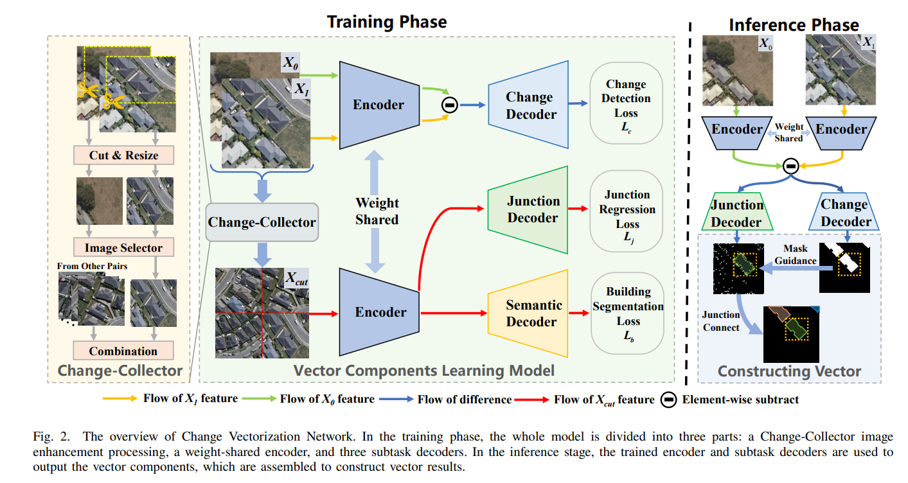

# CVNet
This is Pytorch implementation for "When Vectorization Meets Change Detection". If you have any questions, please contact yanyl@hnu.edu.cn

## Overview
The overall framework for CVNet.


## Installation
Ubuntu-18.04, CUDA 11.0, pytorch1.7/1.8, GCC 7.3
```
conda create -n cvnet python=3.7
conda activate cvnet
conda install pytorch==1.7.0 torchvision==0.8.0 cudatoolkit=11.0 -c pytorch

cd cvnet
conda develop .
pip install -r requirements.txt
```
For evaluation with boundary IoU, please install boundary IoU API following [the installation instruction](https://github.com/bowenc0221/boundary-iou-api).

## Training & Testing
### Data prepare
- The datasets can be downloaded from: 
- WHU-Vector-CD: https://pan.baidu.com/s/1j1hu1gI4yWHQHNWobwQEYA   code：ikls
- LEVIR-Vector-CD: https://pan.baidu.com/s/13loTooaG0hK5zukgVe1sVw   code：ikls

 Please put the change vectorization datasets into datasets folder. The datasets folder is constructed as follows:

code_root/
└── data/
    └── WHU_VectorCD/
        ├── train/
            ├── A
            ├── B
            └── annotation.json
        └── val/
            ├── A
            ├── B
            └── annotation.json
    └── LEVIR_VectorCD/
        ├── train/
            ├── A
            ├── B
            └── annotation.json
        └── val/
            ├── A
            ├── B
            └── annotation.json
        

### Training
The model with HRNetV2 as backbone are initialized with imagenet pretrained parameters. You could download them from https://github.com/HRNet/HRNet-Image-Classification and put them in the path of 
./CVNet/backbones/hrnet_imagenet.
```
bash train.sh
bash unite_train.sh
```
### Testing

```
bash test.sh
```
### Evaluation
We provide implementation of different metrics for evaluation. 
You can run the following command to evaluate the test results in MS-COCO format.

```
python tools/evaluation.py --gt-file [GT_ANNOTATION_FILE] --dt-file [PREDICT_ANNOTATION_FILE] --eval-type boundary_iou
```
## Acknowledgement
This repo benefits from 
[HiSup] (https://github.com/SarahwXU/HiSup),
[ECA-Net](https://github.com/BangguWu/ECANet),
[HR-Net](https://github.com/HRNet/HRNet-Image-Classification),
[boundary iou api](https://github.com/bowenc0221/boundary-iou-api). We thank the authors for their great work.


## BibTeX
```
@article{yan2023vectorization,
  title={When Vectorization Meets Change Detection},
  author={Yan, Yinglong and Yue, Jun and Lin, Jiaxing and Guo, Zhengyang and Fang, Yi and Li, Zhenhao and Xie, Weiying and Fang, Leyuan},
  journal={IEEE Transactions on Geoscience and Remote Sensing},
  year={2023},
  publisher={IEEE}
}
```
